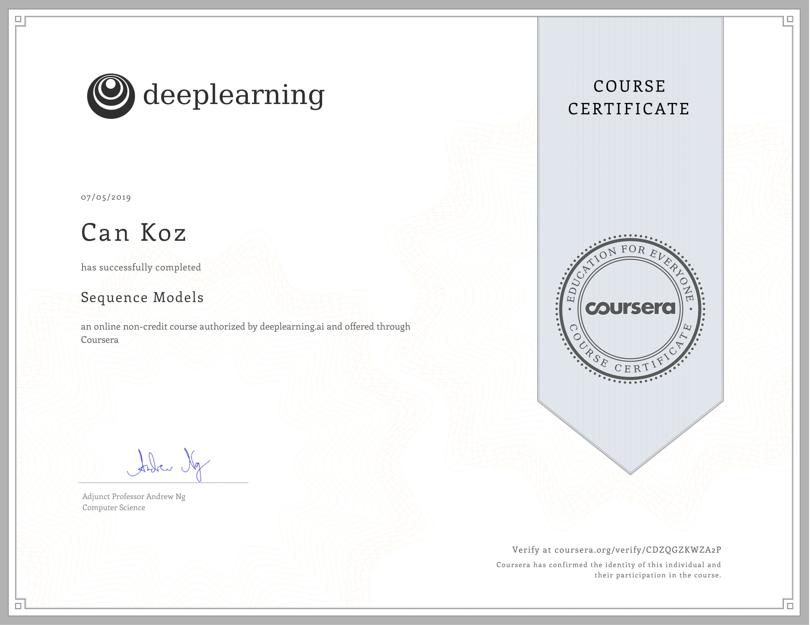
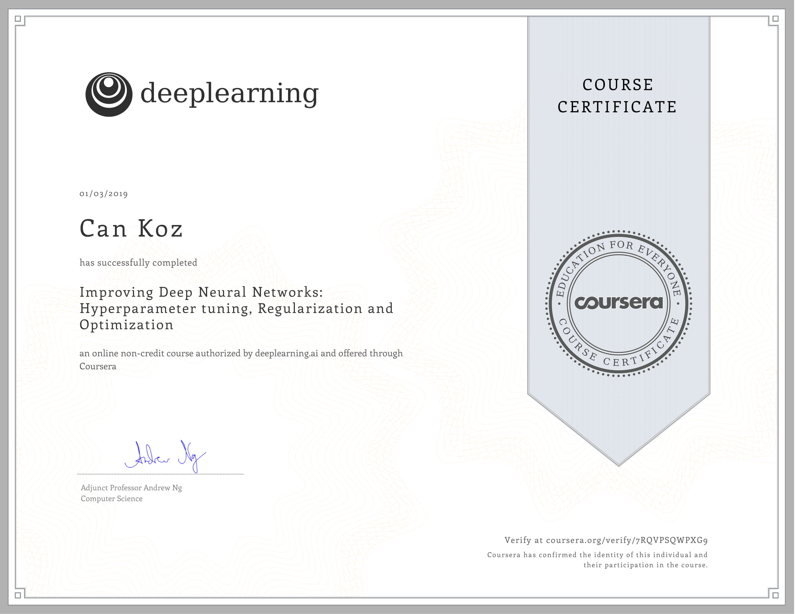
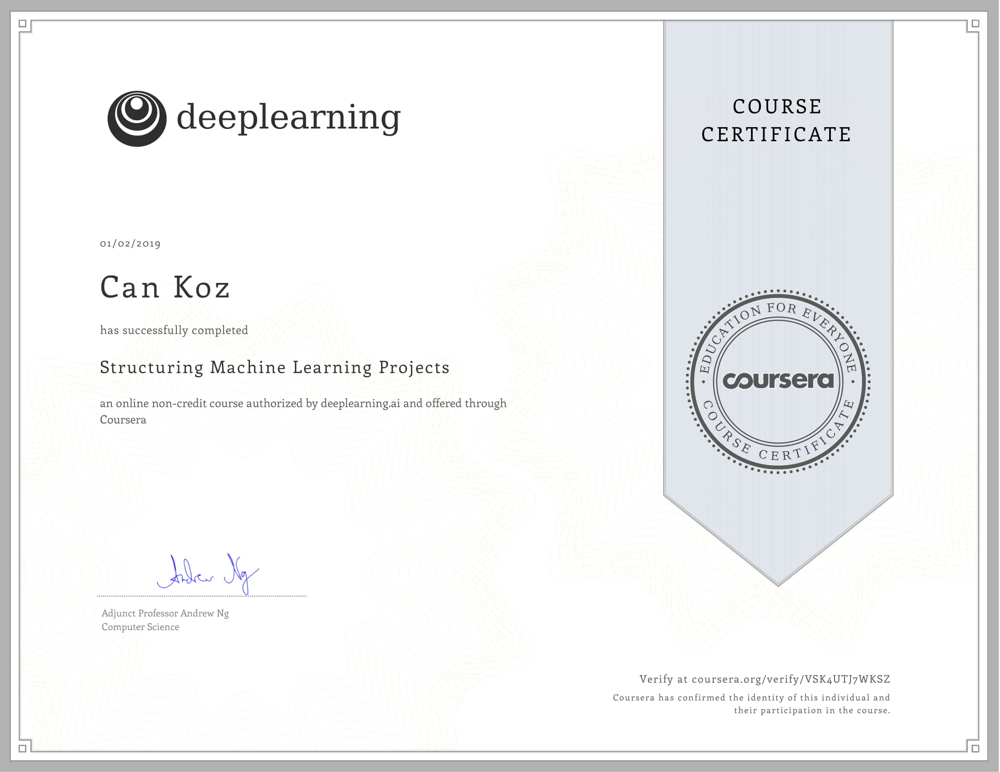
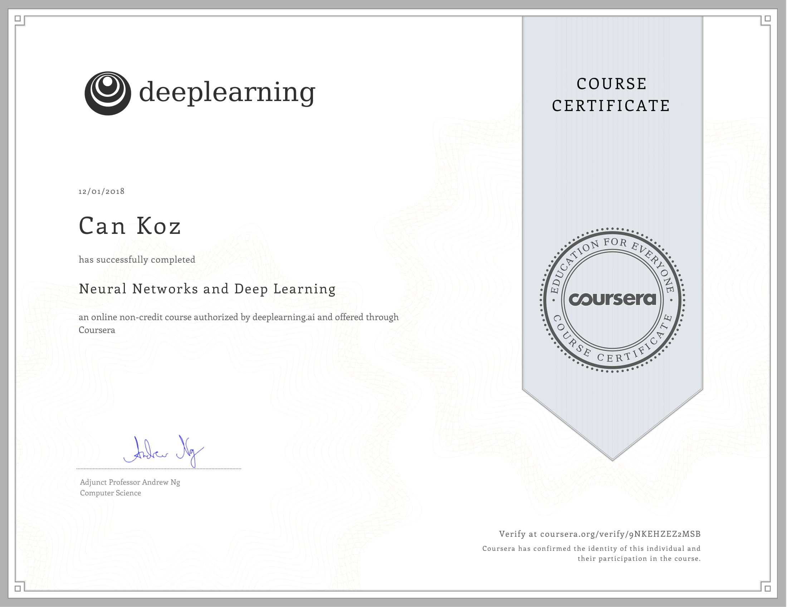

# Deep Learning Specialization Certificates by deeplearning.ai 
My certificates for Deep Learning Specialization by deeplearning.ai

## Completion of the Deep Learning Specialization

- [Completion Certificate of Specialization](https://www.coursera.org/account/accomplishments/specialization/FWCL3REV9TDW)

### Sequence Models

- [Completion Certificate of Course 5](https://www.coursera.org/account/accomplishments/verify/CDZQGZKWZA2P)

### Convolutional Neural Networks

- [Completion Certificate of Course 4](https://www.coursera.org/account/accomplishments/certificate/VCGZUNJTDCNF)

### Improving Deep Neural Networks: Hyperparameter tuning, Regularization and Optimization

- [Completion Certificate of Course 3](https://www.coursera.org/account/accomplishments/certificate/7RQVPSQWPXG9)

### Structuring Machine Learning Projects

- [Completion Certificate of Course 2](https://www.coursera.org/account/accomplishments/certificate/VSK4UTJ7WKSZ)

### Neural Networks and Deep Learning

- [Completion Certificate of Course 1](https://www.coursera.org/account/accomplishments/certificate/9NKEHZEZ2MSB)
